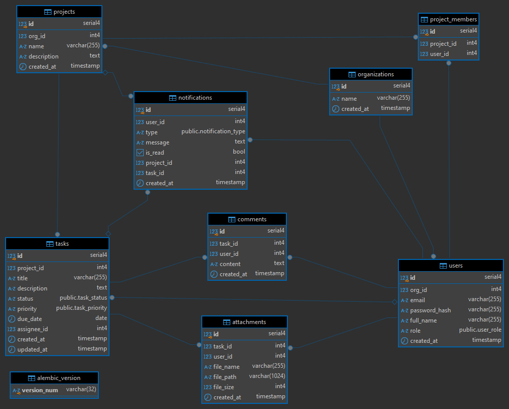
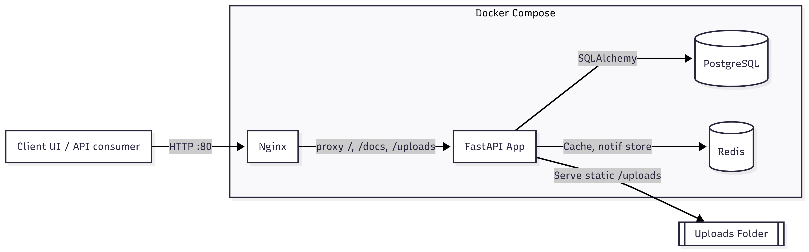

# 📑 Intern Backend Developer Assignment

- Copyright (c) River Flow Solutions, Jsc. 2025. All rights reserved.
- We only use the submissions for candidates evaluation.

## **A. Instructions**
- Candidate must fork this repository to a public repo under their name for submission. Notify email `hr@riverflow.solutions` when done.
- Build a **multi-organization Task Management backend** (organizations → projects → tasks) with basic collaboration and notifications.  
- **Stack**: Python, FastAPI, PostgreSQL, Redis, Nginx.
- Use Justfile for all run and development commands.
- Use Docker for deployment.
- Deliverables: GitHub repo, ER + System design diagrams, Dockerized deployment, README. 

---

## **B. Task Management Requirements & Use Cases**

### **B1. Functional Scope**
- **Organizations & Users**
  - Each user belongs to an organization.  
  - Roles: **Admin**, **Manager**, **Member**.  

- **Projects**
  - Belong to one organization.  
  - Can add/remove members.  
  - Admin/Manager can create projects, Members can only participate.  

- **Tasks**
  - CRUD operations.  
  - Belong to a project.  
  - Fields: title, description, status (`todo/in-progress/done`), priority (`low/medium/high`), due_date, assignee.  
  - Status workflow: `todo → in-progress → done` (no complex review step).  

- **Collaboration**
  - Users can comment on tasks.  
  - Users can upload simple file attachments (local storage).  

- **Notifications**
  - Users receive a notification when:  
    - They are assigned a task.  
    - Task status changes.  
    - A comment is added to their task.  

- **Reports (Basic)**
  - Count of tasks by status in a project.  
  - List of overdue tasks.  

---

### **B2. Use Cases**
1. **User Management**
   - Register/login with JWT.  
   - Admin adds users to the organization.  

2. **Project Management**
   - Create/list projects.  
   - Add/remove project members.  

3. **Task Management**
   - Create tasks with title, description, assignee, priority, due date.  
   - Update task status (`todo → in-progress → done`).  
   - List tasks in a project (filter by status, assignee, priority).  

4. **Collaboration**
   - Add comments to tasks.  
   - Upload attachment to a task.  

5. **Notifications**
   - Retrieve unread notifications.  
   - Mark notifications as read.  

6. **Reporting**
   - Get per-project task count by status.  
   - Get overdue tasks in a project.  

---

### **B3. Business Rules**
- Only project members can create or update tasks in that project.  
- Only Admin/Manager can assign tasks to others. Members can assign only to themselves.  
- Due date must be today or in the future (not past).  
- Task status can only progress forward (`todo → in-progress → done`), but not backward.  
- Attachments limited to 5MB each, max 3 per task.  

---

## **C. Tech Requirements**
- **Backend**: Python + FastAPI, SQLAlchemy, Alembic migrations.  
- **Database**: PostgreSQL with foreign keys + indexes.  
- **Cache/Notify**: Redis for caching task lists and storing notifications.  
- **Auth**: JWT (PyJWT) + role-based access (Admin/Manager/Member).  
- **Testing**: pytest with mock PostgreSQL & Redis.  
- **Deployment**: Docker + docker-compose (FastAPI + PostgreSQL + Redis + Nginx).  

---

## **D. Review Criteria**

### **D1. Database & System Design**
- [ ] Schema with correct relations & constraints.  
- [ ] Indexes on `users(email)`, `tasks(status, project_id)`.  
- [ ] ER diagram + system design diagram included.  

### **D2. Core Functionality**
- [ ] JWT auth with role-based permissions.  
- [ ] CRUD for Projects and Tasks with proper rules.  
- [ ] Status workflow enforced (`todo → in-progress → done`).  
- [ ] Comments & file attachments working.  
- [ ] Notifications created on assign/status/comment.  
- [ ] Basic reporting endpoints working.  

### **D3. Code Quality**
- [ ] Centralized error handling & logging.  
- [ ] Configurable via `.env`.  

### **D4. Testing**
- [ ] Coverage ≥ 70%.  

### **D5. Deployment**
- [ ] Nginx configuration.  
- [ ] Dockerized deployment (Include Nginx)

### **D6. Documentation**
- [ ] README with setup guide.  
- [ ] API documentation (Swagger UI).

---

## **E. Diagrams**

### **E1. ER diagram**

### **E2. System Design Diagrams**

---

## **F. Setup Guide**

- Prerequisites: Python 3.11+, `pip`, Git. Optional: Docker + Docker Compose, `just`.
- Two ways to run: Local Python (recommended for dev) or full Docker.

### **F1. Environment Variables (`.env`)**
- Copy `env.example` to `.env` and adjust values for your environment.
- When using Docker Compose, use service hostnames (e.g., `postgres`, `redis`).

### **F2. Option A — Local Development (Python)**
- Create and activate a virtualenv:
  - macOS/Linux: `python3 -m venv venv && source venv/bin/activate`
  - Windows (PowerShell): `py -m venv venv; ./venv/Scripts/Activate.ps1`
- Install deps: `pip install -r requirements-dev.txt`
- Start Postgres and Redis (choose one):
  - Using Docker for services only: `docker compose up -d postgres redis`
  - Or use your local Postgres/Redis and ensure `.env` points to them.
- Initialize DB and run migrations: `just setup-db` (or `alembic upgrade head`)
- Seed sample data (optional): `just seed`
- Run the API: `just run` → http://localhost:8000/docs
- Run tests: `just test` (or coverage HTML: `just test-cov`)

### **F3. Option B — Full Docker (API + DB + Redis + Nginx)**
- Ensure `.env` uses service hostnames (`postgres`, `redis`).
- Start stack: `docker compose up -d --build`
- Initialize DB inside the backend container:
  - `docker exec -it task-backend python scripts/setup_db.py`
- Seed sample data (optional):
  - `docker exec -it task-backend python scripts/seed.py`
- Open API via Nginx: http://localhost and docs at http://localhost/docs
- Logs (follow): `docker compose logs -f`
- Stop: `docker compose down`

### **F4. Default Seeded Accounts**
- Org: "RFX DN" and "OtherOrg" created.
- Users (password for all: `password`):
  - Admin: `admin@example.com`
  - Manager: `manager@example.com`
  - Members: `member0@example.com` … `member5@example.com`

### **F5. Useful `just` Commands**
- `just` (no args): lists commands
- `just dev-setup`: installs dev deps, sets up DB, seeds
- `just run`: starts FastAPI (reload) on `:8000`
- `just db-migrate message="add table"`: create Alembic revision
- `just db-upgrade`: apply latest migrations
- `just format` / `just lint` / `just type-check`: code quality

### **F6. Troubleshooting**
- Migrations not applied: run `alembic upgrade head` (or `just setup-db`).
- Uploads: ensure `uploads/` exists and is writable.
